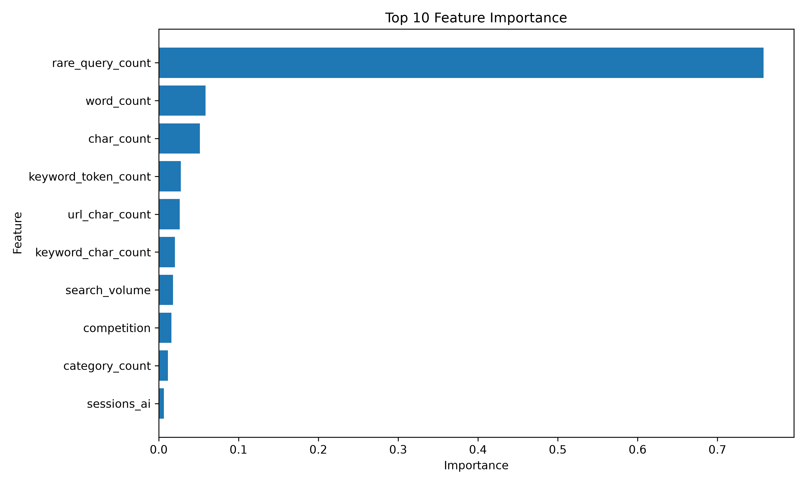
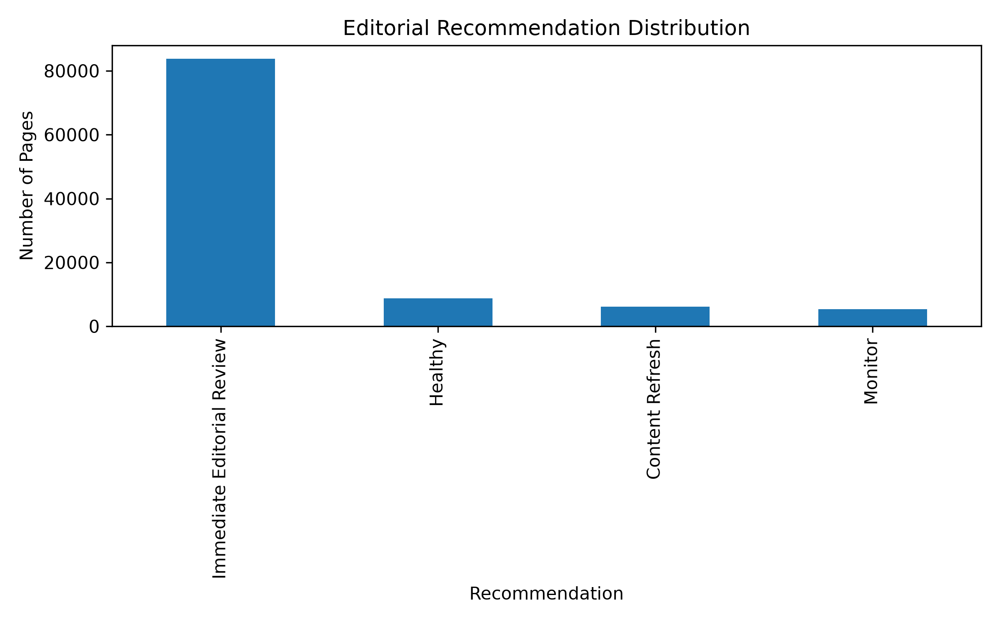

# Predicting Low-Engagement Web Pages for Editorial Review 


An end-to-end machine learning pipeline that predicts webpages requiring editorial review using anonymized Google Search Console (GSC) and Google Analytics 4 (GA4) warehouse data.

Built as the capstone project for the **FlyRank Machine Learning Internship**.

---

## Project Overview

Editorial teams managing thousands of webpages cannot manually identify which pages require immediate attention. This project develops a complete machine learning workflow that predicts low-engagement webpages and converts model predictions into ranked editorial recommendations.

The project includes:

- Data ingestion
- Exploratory Data Analysis (EDA)
- Data preprocessing
- Feature engineering
- Model training
- Model explainability
- Editorial recommendation engine
- Research paper deployment

---

## Machine Learning Pipeline

```text
Data Ingestion
        │
        ▼
Exploratory Data Analysis
        │
        ▼
Data Preprocessing
        │
        ▼
Feature Engineering
        │
        ▼
Model Training
        │
        ▼
Model Explainability
        │
        ▼
Editorial Recommendation Engine
        │
        ▼
Research Paper
```

---

## Dataset

The project uses the anonymized FlyRank Machine Learning Internship warehouse dataset containing Google Search Console (GSC) and Google Analytics 4 (GA4) metrics.

Warehouse tables include:

- dim_content
- fact_content_daily_performance
- fact_content_query_90d
- dim_clients

The dataset contains no client names, URLs, or private search queries.

---

## Repository Structure

```text
flyrank-ml-internship/

├── docs/
│   ├── index.html
│   ├── model_performance.png
│   ├── feature_importance.png
│   └── recommendation_distribution.png
│
├── submission/
│   └── paper_url.txt
│
├── work/
│   └── low_engagement_prediction/
│       ├── artifacts/
│       ├── config/
│       ├── data/
│       ├── reports/
│       ├── scripts/
│       └── src/
│
└── README.md
```
---

# Project Modules

The project is organized into eight sequential modules.

| Module | Description |
|---------|-------------|
| Module 1 | Data Ingestion |
| Module 2 | Exploratory Data Analysis (EDA) |
| Module 3 | Data Preprocessing |
| Module 4 | Feature Engineering |
| Module 5 | Model Training & Evaluation |
| Module 6 | Model Explainability |
| Module 7 | Editorial Recommendation Engine |
| Module 8 | Research Paper |

---

# Models

Two supervised machine learning models were trained and evaluated.

| Model | Purpose |
|--------|----------|
| Logistic Regression | Baseline linear classifier |
| Random Forest Classifier | Final production model |

The Random Forest classifier achieved the strongest predictive performance and was selected as the final recommendation model.

---

# Model Performance

| Model | Accuracy | Precision | Recall | F1-score | ROC-AUC |
|--------|---------:|----------:|--------:|---------:|---------:|
| Logistic Regression | 89.93% | 90.12% | 99.59% | 94.62% | 74.88% |
| **Random Forest** | **93.64%** | **96.07%** | **96.81%** | **96.44%** | **95.24%** |

---

# Feature Importance

The Random Forest model identified the following features as the most influential:

1. rare_query_count
2. word_count
3. char_count
4. keyword_token_count
5. url_char_count
6. keyword_char_count
7. search_volume
8. competition
9. category_count
10. sessions_ai

---

## Random Forest Feature Importance

<p align="center">



</p>

---

# Recommendation Engine

The trained model generates ranked editorial recommendations rather than simple binary predictions.

Each webpage is assigned to one of four priority levels:

| Recommendation | Action |
|---------------|--------|
| Immediate Editorial Review | Review immediately |
| Content Refresh | Refresh existing content |
| Monitor | Continue monitoring |
| Healthy | No immediate action |

---

## Recommendation Distribution

<p align="center">



</p>

The recommendation engine enables editorial teams to prioritize optimization efforts by ranking webpages according to predicted editorial review probability.

---

# Installation

Clone the repository:

```bash
git clone https://github.com/MUKUL-TIWARI/flyrank-ml-internship.git
```

Move into the project directory:

```bash
cd flyrank-ml-internship
```

Create a virtual environment:

```bash
python -m venv .venv
```

Activate the environment.

Windows

```bash
.venv\Scripts\activate
```

Linux / macOS

```bash
source .venv/bin/activate
```

Install the required packages:

```bash
pip install -r requirements.txt
```

---

# Running the Pipeline

Execute the modules in the following order.

```bash
python work/low_engagement_prediction/scripts/download_data.py
```

```bash
python work/low_engagement_prediction/scripts/run_eda.py
```

```bash
python work/low_engagement_prediction/scripts/preprocess_data.py
```

```bash
python work/low_engagement_prediction/scripts/engineer_features.py
```

```bash
python work/low_engagement_prediction/scripts/train_model.py
```

```bash
python work/low_engagement_prediction/scripts/explain_model.py
```

```bash
python work/low_engagement_prediction/scripts/generate_recommendations.py
```

---

# Research Paper

The complete capstone research paper is available on GitHub Pages.

**Live Paper**

https://mukul-tiwari.github.io/flyrank-ml-internship/

The paper includes:

- Abstract
- Introduction
- Dataset
- Methodology
- Results
- Explainability
- Recommendation Engine
- Limitations
- Reproducibility

---

# Project Highlights

- End-to-end machine learning pipeline
- Feature engineering from warehouse data
- Logistic Regression baseline
- Random Forest final model
- Model explainability
- Ranked editorial recommendation engine
- Research paper deployment using GitHub Pages
- Modular and reproducible project structure

---

# Future Improvements

Potential future work includes:

- SHAP-based model explainability
- Gradient Boosting (XGBoost / LightGBM)
- Hyperparameter optimization
- Temporal validation
- Automated model retraining
- Interactive dashboard for editorial recommendations

---

# Acknowledgements

This project was completed as part of the **FlyRank Machine Learning Internship**.

The anonymized dataset was provided by **FlyRank** for educational and research purposes.

Special thanks to the FlyRank team for designing a project that covers the complete machine learning lifecycle—from data ingestion to deployment and decision support.

Data Source:

https://flyrank.ai

---

# Author

**Mukul Tiwari**

Machine Learning | AI Engineering | Data Science

GitHub:

https://github.com/MUKUL-TIWARI

Research Paper:

https://mukul-tiwari.github.io/flyrank-ml-internship/

---

## License

This project was developed for educational purposes as part of the FlyRank Machine Learning Internship.