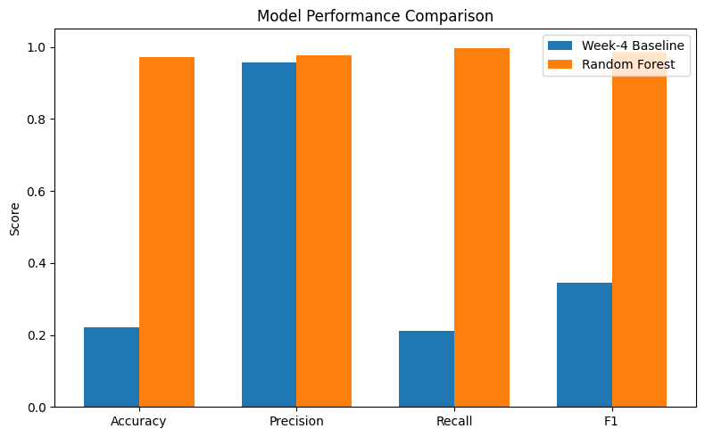
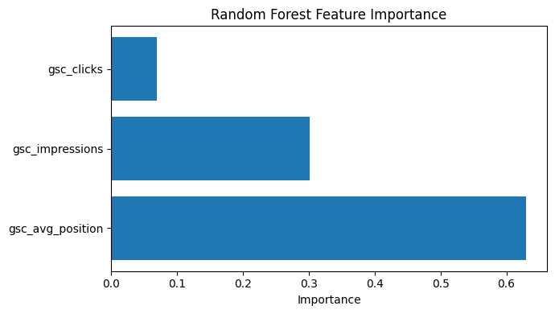

# Predicting Low-Engagement Web Pages for Editorial 

## Abstract

Editorial teams often manage thousands of web pages, making it difficult to identify which pages deserve attention first. This study investigates whether publicly available search performance metrics can be used to identify pages that are likely to receive low user engagement and therefore benefit from editorial review.

Using search-related features such as impressions, clicks, and average search position, a Random Forest classifier was trained to predict low-engagement pages. The model achieved strong predictive performance while relying only on information available before prediction, reducing the risk of feature leakage.

The results demonstrate that machine learning can support editorial prioritization by highlighting pages that may require content improvement. Rather than replacing human judgment, the model provides decision-support that helps content teams focus their efforts more efficiently.

---

## 1. Introduction

Large content platforms continuously publish and maintain thousands of web pages. Because editorial resources are limited, manually identifying pages that require attention is difficult and time-consuming.

This project addresses a practical content management problem inspired by FlyRank's machine learning internship: identifying low-engagement pages that could benefit from editorial review. Instead of relying on manual inspection, machine learning can prioritize pages using search performance signals that are available before prediction.

A Random Forest classifier was developed using search metrics such as impressions, clicks, and average search position. The objective is not to replace editorial decisions but to provide decision-support that helps teams identify content opportunities more efficiently while avoiding feature leakage and maintaining reproducible analysis.

---

## 2. Data

The dataset used in this project was provided as part of the FlyRank Machine Learning Internship. It combines website performance data from Google Search Console (GSC) and Google Analytics 4 (GA4).

For this study, three features were selected:

- **gsc_impressions** – Number of times a page appeared in Google Search results.
- **gsc_clicks** – Number of clicks received from Google Search.
- **gsc_avg_position** – Average search ranking position of the page.

The target variable was defined using the GA4 metric **engaged sessions**. Pages with zero engaged sessions were labeled as requiring editorial review, while all other pages were labeled as not requiring immediate review.

The dataset was loaded into DuckDB from the provided Parquet files, cleaned by removing missing values, and prepared for supervised machine learning.

---

## 3. Methodology

The objective of this project was to predict whether a webpage would receive zero engaged sessions using search performance metrics.

A simple rule-based baseline was first created using the average search position. Pages with an average position greater than 20 were predicted as requiring editorial review. This baseline provided a reference point for evaluating the machine learning model.

The primary model used in this project was a Random Forest Classifier from scikit-learn. The model was trained using the following three input features:

- gsc_impressions
- gsc_clicks
- gsc_avg_position

The dataset was divided into training and testing sets using an 80/20 split. Model performance was evaluated using Accuracy, Precision, Recall, and F1-score.

To verify that the model generalized well, an additional grouped validation split was performed to reduce the risk of data leakage between similar pages.

---

## 4. Results

The Random Forest model substantially outperformed the rule-based baseline across all evaluation metrics.

| Model | Accuracy | Precision | Recall | F1-score |
|-------|---------:|----------:|--------:|---------:|
| Baseline | 0.221 | 0.957 | 0.210 | 0.345 |
| Random Forest | 0.972 | 0.976 | 0.996 | 0.986 |

The Random Forest classifier achieved substantially better performance than the rule-based baseline. In particular, the model obtained an F1-score of 0.986 compared with 0.345 for the baseline while maintaining very high recall (0.996). These results indicate that the selected search performance features are effective predictors of pages requiring editorial review.

Feature importance analysis showed that search impressions, clicks, and average search position all contributed to the model's predictions, with search visibility metrics providing the strongest signals.

A grouped validation experiment achieved an accuracy of 0.967, which was very close to the random train-test split accuracy of 0.972. This consistency suggests that the model generalized well and that the evaluation was not significantly affected by data leakage.

### Model Performance Comparison

The following chart compares the performance of the baseline method and the Random Forest model across all evaluation metrics.

### Feature Importance

The figure below shows the relative importance of each feature used by the Random Forest model. Search impressions contributed the most to the predictions, followed by clicks and average search position.

---

## 5. Limitations & Honest Framing

Although the model achieved excellent predictive performance, several limitations should be considered.

The model was trained using only three input features. Additional information such as page content, page age, backlinks, or user behavior could further improve prediction quality.

The dataset represents a specific website environment and may not generalize perfectly to all websites without retraining.

Finally, the model is intended to assist editorial teams by prioritizing pages for review rather than replacing human decision-making.

---

## 6. Ranked Recommendations

Based on the model predictions, editorial teams should prioritize pages predicted to receive zero engaged sessions. These pages are the most likely candidates for content improvement.

Recommended actions include:

1. Review pages with poor search visibility.
2. Update outdated or low-quality content.
3. Improve titles and meta descriptions to increase click-through rates.
4. Add internal links to important pages.
5. Monitor the impact of changes using Google Analytics 4 and Google Search Console.

The model should be used as a decision-support tool that helps editors prioritize their workload rather than as a replacement for human expertise.

---

## 7. Reproducibility

This project was implemented entirely in Python using open-source libraries.

Main tools used include:

- Python
- Pandas
- DuckDB
- Scikit-learn
- Matplotlib

The workflow consists of:

1. Loading the dataset from Parquet files.
2. Creating the target label.
3. Training a Random Forest classifier.
4. Evaluating the model against a rule-based baseline.
5. Validating the model using both random and grouped data splits.
6. Producing feature importance analysis and performance visualizations.

All code required to reproduce this project is available in the GitHub repository.

Repository:
https://github.com/MUKUL-TIWARI/flyrank-ml-internship

Notebook:
work/notebooks/capstone.ipynb

The repository includes the notebook, generated figures, and this research paper.

---

## 8. Acknowledgments & Data Credit

This work was completed as part of the FlyRank Machine Learning Internship.

The dataset was provided by **FlyRank** for educational purposes and combines anonymized Google Search Console (GSC) and Google Analytics 4 (GA4) metrics.

Built on the **FlyRank ML Internship dataset**.

Data source: <https://flyrank.ai>

The project follows the internship guidelines and uses only the provided data for model development and evaluation.
